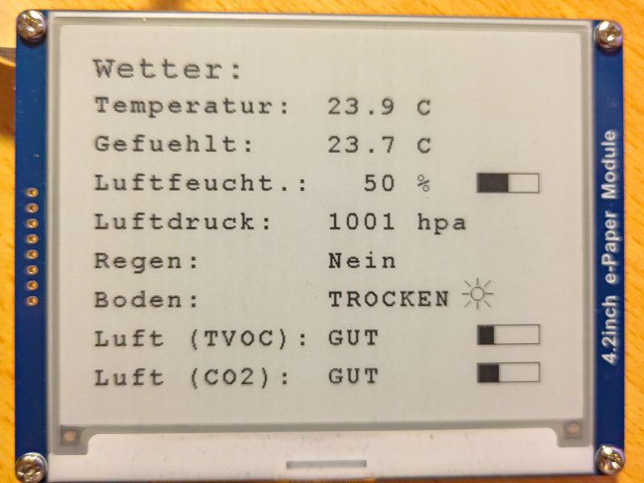

# weatherstation
A local weather station for testing ESP32 sensors

## Overview

The idea is to
- use a cheap and low energy consuming ESP32 as base
- use a bunch of sensors for getting an idea of the environment
- draw the data on a waveshare e-paper display

## Devices

ESP32 device:
https://www.waveshare.com/wiki/E-Paper_ESP32_Driver_Board

E-Paper display:
https://www.waveshare.com/4.2inch-e-paper-module.htm

Sensors:
https://www.sunfounder.com/products/sensor-kit-v2-for-arduino?_pos=2&_sid=1bdf16cc9&_ss=r

I use explicitly the
- Barometer
- Raindrop Sensor
- Humidity Sensor

Furthermore the device uses a soil moisture senesor from here:

https://www.seeedstudio.com/Grove-Capacitive-Moisture-Sensor-Corrosion-Resistant.html

And an air quality sensor from here:

https://wiki.seeedstudio.com/Grove-VOC_and_eCO2_Gas_Sensor-SGP30/

# Pinouts (for now)

This is not the exact model but it seems to have the same pinout. Sadly the documentation on Waveshare is not the best.

The schematics look currently like that:

Right now (06.08.23) it still looks like that (and in German only). But you get an idea where this project might go.

## Barometer

- Black - GROUND
- Red - 3.3V
- White - GPIO 21 (DEFAULT SDA)
- Brown - GPIO 22 (DEFAULT SCL)
- I2C: 0x77

## Raindrop Sensor

This is connected via a Raindrop Sensor (which connects again to the device).

- Black - GROUND
- Red - 3.3V
- White - GPIO 36 (ANALOG AO)
- Brown - GPIO 25 (D0)

## Humiture Sensor

- Black - GROUND
- Red - 3.3V
- Yellow - GPIO 32

## Soil Moisture Sensor

- Black - GROUND
- Red - 3.3V
- White - GPIO ??
- Brown - GPIO ??

## Air Quality Sensor

- Black - GROUND
- Red - 3.3V
- White - GPIO 21 (DEFAULT SDA)
- Brown - GPIO 22 (DEFAULT SCL)
- I2C: 0x58

NOTE: they share the same

I also calculate the "air quality" by very simple means.

These are the constants I use:

#define VOC_LOW 25
#define VOC_MED 75
#define CO2_LOW 450
#define CO2_MED 550

And I draw them on the display in a very simple graph, indicating the quality.
This surely can be done better.

# Known issues:

When there is rain on the rain sensor, the voltage it draws seems to be too high and the display doesn't refresh anymore. I guess I have to plug this to the 5V. Gonna try that...

# Schematics

I tried to use Fritzing for a better schematics diagram.

Since the software lacks some of the components I need, I used many of these repositories:

https://github.com/sunfounder/sunfounder-uno-and-mega-kit
https://github.com/jorgechacblogspot/librerias_fritzing
https://github.com/OgreTransporter/fritzing-parts-extra/tree/master
https://github.com/Seeed-Studio/fritzing_parts
