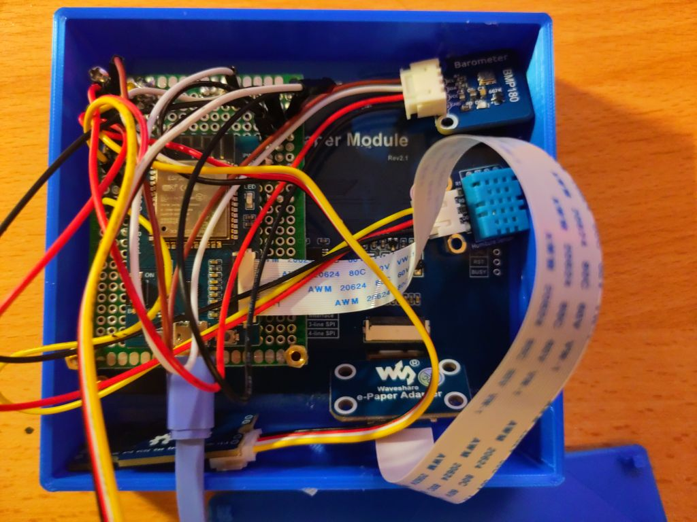

# weatherstation
A local weather station for testing ESP32 sensors

## Overview

The idea is to
- use a cheap and low energy consuming ESP32 as base
- use a bunch of sensors for getting an idea of the environment
- draw the data on a waveshare e-paper display

## Devices

ESP32 device:
https://www.waveshare.com/wiki/E-Paper_ESP32_Driver_Board

E-Paper display:
https://www.waveshare.com/4.2inch-e-paper-module.htm

Sensors:
https://www.sunfounder.com/products/sensor-kit-v2-for-arduino?_pos=2&_sid=1bdf16cc9&_ss=r

I use explicitly the
- Barometer
- Raindrop Sensor
- Humidity Sensor

Furthermore the device uses a soil moisture senesor from here:

https://www.seeedstudio.com/Grove-Capacitive-Moisture-Sensor-Corrosion-Resistant.html

And an air quality sensor from here:

https://wiki.seeedstudio.com/Grove-VOC_and_eCO2_Gas_Sensor-SGP30/

# Pinouts (for now)

This is not the exact model but it seems to have the same pinout. Sadly the documentation on Waveshare is not the best.

The schematics look currently like that:

The first version of it (which is in usage) looks like that (and in German only).

## Barometer

- Black - GROUND
- Red - 3.3V
- White - GPIO 21 (DEFAULT SDA)
- Brown - GPIO 22 (DEFAULT SCL)
- I2C: 0x77

## Raindrop Sensor

This is connected via a Raindrop Sensor (which connects again to the device).

- Black - GROUND
- Red - 3.3V
- White - GPIO 36 (ANALOG AO)
- Brown - GPIO 25 (D0)

## Humidity Sensor

- Black - GROUND
- Red - 3.3V
- Yellow - GPIO 32

## Soil Moisture Sensor

- Black - GROUND
- Red - 3.3V
- White - GPIO ??
- Brown - GPIO ??

Note that the soil moisture sensor is just an analog one. It checks the resistence and varies for example if you provide 3.3V or 5V to it.
Hence the setup might vary your constants.

I plugged it to 3.3 volt and defined the constants as

- SOIL_DRYNESS_HIGH 2000

- SOIL_DRYNESS_MEDIUM 1150

where the analog value goes higher the dryer the ground is.

## Air Quality Sensor

- Black - GROUND
- Red - 3.3V
- White - GPIO 21 (DEFAULT SDA)
- Brown - GPIO 22 (DEFAULT SCL)
- I2C: 0x58

NOTE: they share the same

I also calculate the "air quality" by very simple means.

These are the constants I use:

- VOC_LOW 25

- VOC_MED 75

- CO2_LOW 450

- CO2_MED 550

And I draw them on the display in a very simple graph, indicating the quality.
This surely can be done better.

# Known issues:

1. When there is rain on the rain sensor, the voltage it draws seems to be too high and the display doesn't refresh anymore. I therefore (and for it's limited usage) removed the sensor for version 1.

2. Also the case I printed comes with some drawbacks. Even as a physics enthusiast it took a while to realize that CO2 is heavier than O2. And with basically no opening in the case the CO2 value was rising over the time to higher and higher values. In any case you should avoid placing the air quality sensor at the bottom of the case! And add some holes to the rear side.

3. Furthermore you need to make sure the temperature sensor is not too close to the ESP32. In my example the heat from the processor is radiating to the temperature sensor leading to 1-2 degrees higher temperature.

I originally thought I could put it inside like this:

which would be still not great but not horrible either. However, with the tiny case I had to squeeze eveything to gether ending up with a crammed case where everything is right next to eachother. Version 2 has to be a little bigger!

# Schematics

I tried to use Fritzing for a better schematics diagram.

Since the software lacks some of the components I need, I used many of these repositories:

https://github.com/sunfounder/sunfounder-uno-and-mega-kit
https://github.com/jorgechacblogspot/librerias_fritzing
https://github.com/OgreTransporter/fritzing-parts-extra/tree/master
https://github.com/Seeed-Studio/fritzing_parts
